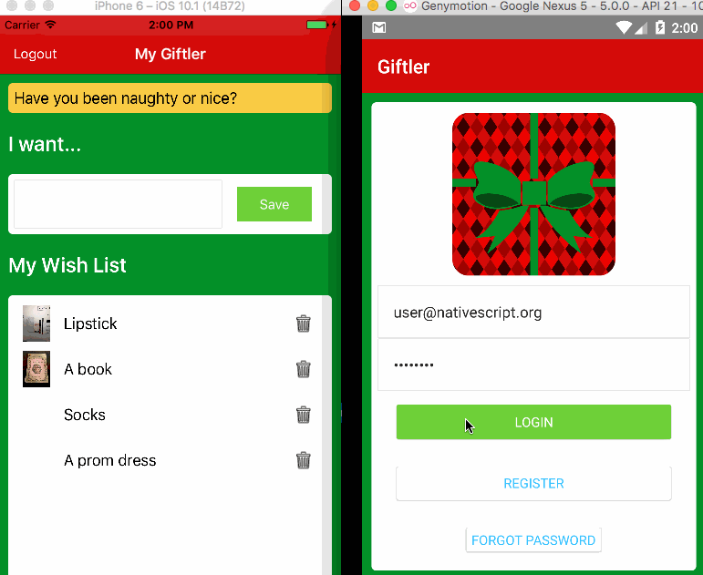

# Giftler - Make managing holiday wish lists super easy!

This codebase is a demo to show how to use Angular 2 with NativeScript and Firebase to create a mobile app for holiday wish-list management.

- Using the Firebase Authentication module, register, log in, and manage your password.
- Using the Firebase Realtime Database, manage data flow (create, edit, and delete).
- Using Firebase's Remote Config service, send messages to your app
- Using the Storage Bucket that comes with your Firebase account, save photos of your gifts!

Read the article, forthcoming on various blogs <TBD>

